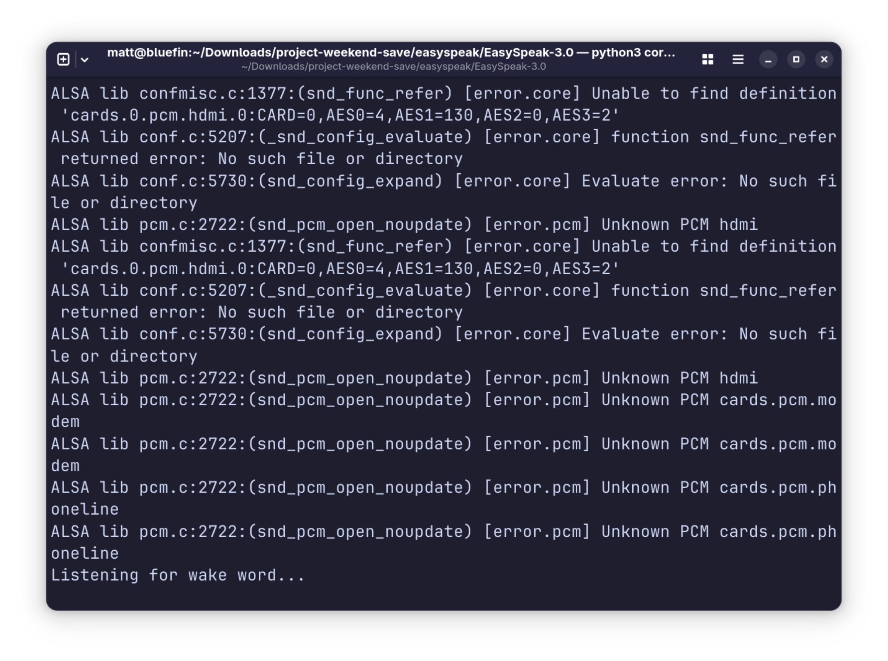
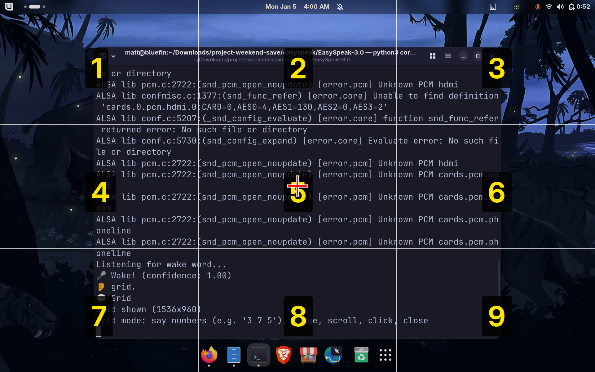
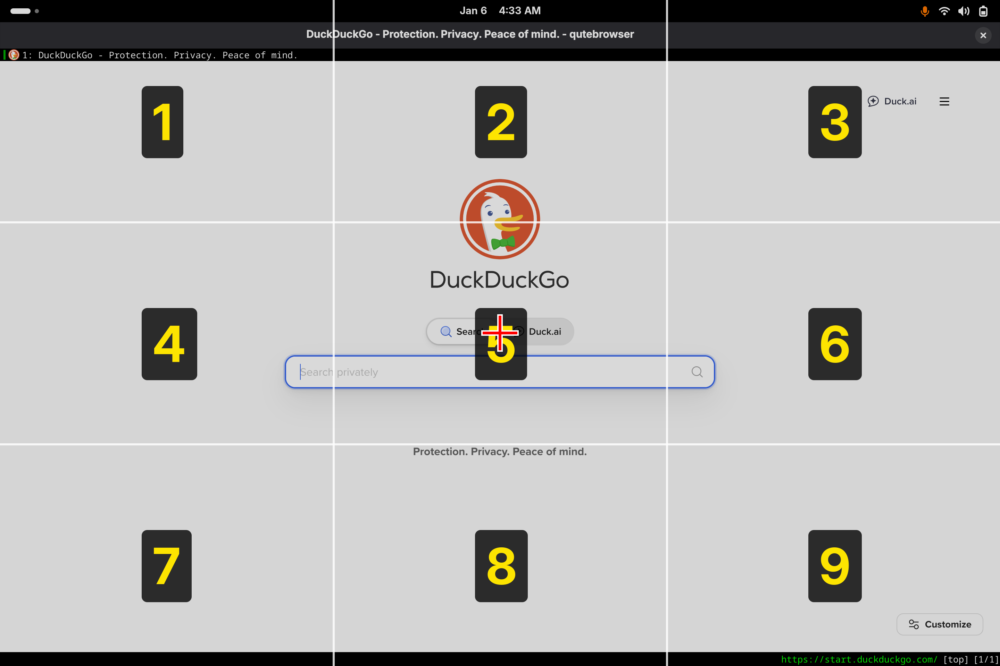

# EasySpeak

Voice control for Linux desktops. Fully local, no cloud, Wayland-native.

Say "Hey Jarvis" and control your desktop with your voice.


> ⚠️ **Early development.** This project works but is not polished. Expect bugs, incomplete docs, and changes without notice.

## Why EasySpeak?

Linux desktop voice control is a gap. Talon exists but has a steep learning curve and costs money for the full version. Most other tools are X11-only, abandoned, or cloud-dependent.

EasySpeak is:
- **Free and open source** - GPL-3.0 licensed, no paywalls
- **Fully local** - No cloud, no accounts, no data leaving your machine
- **Wayland-native** - Works on modern GNOME desktops where X11 tools fail
- **Simple** - Say "Hey Jarvis, open downloads" and it works
- **Extensible** - Drop a Python file in plugins/ to add commands

Built for people with RSI, accessibility needs, hands-busy workflows, or anyone who wants to talk to their computer.

## Features

Current and in active development:

- **Wake word activation** - Hands-free with "Hey Jarvis"
- **Mouse grid** - Navigate anywhere on screen with voice ("grid", "3 7 5", "click")
- **Head tracking** - Control cursor with head movement (experimental)
- **Browser control** - Qutebrowser integration with link hints, tabs, scrolling
- **Dictation** - Voice-to-text in any text field with punctuation commands
- **App launcher** - Open and close applications by name
- **Media control** - Play, pause, skip via MPRIS
- **System controls** - Volume, brightness, do not disturb
- **Fully local** - OpenWakeWord + Whisper + Piper, no cloud services
- **Wayland-native** - Works properly on modern Linux desktops
- **Plugin architecture** - Easy to extend

## Demo

**Terminal output:**



**Mouse grid (full screen):**



**Mouse grid (zoomed):**



**Browser mode:**


## Requirements

- Linux with GNOME Shell 47+ on Wayland
- Python 3.12 or 3.13 (not 3.14 - see installation notes)
- Working microphone
- ~2GB disk space for models

Tested on Fedora 43.

## Installation

Fedora 43's default `python3` is 3.14, which breaks dependencies. Install Python 3.13:
```bash
sudo dnf install python3.13
python3.13 --version  # Verify it's installed
```

### 1. System Packages

```bash
sudo dnf install \
  pipewire-utils \
  wireplumber \
  at-spi2-core \
  python3-gobject \
  qutebrowser \
  glib2 \
  ffmpeg-free \
  pulseaudio-utils \
  sound-theme-freedesktop \
  portaudio-devel \
  python3.13-devel \
  gcc
```

### 2. Python Packages

```bash
python3.13 -m venv ~/easyspeak-venv
source ~/easyspeak-venv/bin/activate
pip install faster-whisper openwakeword numpy pyaudio
```

### 3. Piper TTS

```bash
mkdir -p ~/.local/bin
cd ~/.local/bin
wget https://github.com/rhasspy/piper/releases/download/2023.11.14-2/piper_linux_x86_64.tar.gz
tar xzf piper_linux_x86_64.tar.gz
rm piper_linux_x86_64.tar.gz

echo 'export PATH="$HOME/.local/bin/piper:$PATH"' >> ~/.bashrc
source ~/.bashrc

mkdir -p ~/.local/share/piper
cd ~/.local/share/piper
wget -O en_US-amy-medium.onnx \
  "https://huggingface.co/rhasspy/piper-voices/resolve/v1.0.0/en/en_US/amy/medium/en_US-amy-medium.onnx"
wget -O en_US-amy-medium.onnx.json \
  "https://huggingface.co/rhasspy/piper-voices/resolve/v1.0.0/en/en_US/amy/medium/en_US-amy-medium.onnx.json"
```

### 4. Clone Repository

```bash
git clone https://github.com/ctsdownloads/easyspeak.git ~/easyspeak
cd ~/easyspeak
```

### 5. GNOME Shell Extension

```bash
mkdir -p ~/.local/share/gnome-shell/extensions/easyspeak-grid@local
cp extension.js metadata.json ~/.local/share/gnome-shell/extensions/easyspeak-grid@local/
```

**Log out and back in** (GNOME Shell must restart to detect new extensions).

Then enable:
```bash
gnome-extensions enable easyspeak-grid@local
```

### 6. Enable Accessibility

```bash
gsettings set org.gnome.desktop.interface toolkit-accessibility true
```

### 7. Configure Qutebrowser

EasySpeak uses number hints (not letters). Configure qutebrowser:

```bash
mkdir -p ~/.config/qutebrowser
cat > ~/.config/qutebrowser/config.py << 'EOF'
config.load_autoconfig(False)
c.hints.chars = '0123456789'
EOF
```

## Usage

```bash
source ~/easyspeak-venv/bin/activate  # Now python = venv's python3.13
cd ~/easyspeak                         # Go to your code
python core.py                         # Runs with venv packages
```

Activate the venv each time you open a new terminal.

Say "Hey Jarvis" followed by a command.

## Commands

### Mouse Grid

Screen splits into a 3x3 layout (like a phone keypad):

```
1 2 3
4 5 6
7 8 9
```

Say **"grid"** to show it. Say a number to zoom into that zone. Keep zooming until you're over your target, then **"click"**.

Chain numbers to go faster: **"3 6 3"** zooms three times at once.

**Drag and drop:**
1. Navigate to the thing you want to drag
2. Say **"mark"** - grabs it (mousedown)
3. Grid resets to full screen
4. Navigate to where you want to drop it
5. Say **"drag"** - releases it (mouseup)

| Command | Action |
|---------|--------|
| grid | Show grid |
| 1-9 | Zoom to zone |
| 3 7 5 | Chain zones |
| click | Left click |
| double click | Double click |
| right click | Right click |
| middle click | Middle click |
| up/down/left/right | Nudge position |
| left 5, down 3, etc. | Nudge with repeat |
| scroll up/down/left/right | Scroll at cursor |
| scroll down 3, etc. | Scroll with repeat |
| mark | Grab (start drag) |
| drag | Drop (end drag) |
| again | Reopen at last spot |
| close | Hide grid |

### Head Tracking (Experimental)

Requires webcam and additional dependencies (`pip install sixdrepnet opencv-python`).

| Command | Action |
|---------|--------|
| start tracking | Begin head tracking |
| stop tracking | End tracking |
| freeze | Lock cursor position |
| go | Resume tracking |
| recalibrate | Reset center position |
| nudge up/down/left/right | Fine tune when frozen |
| click | Left click |
| double click | Double click |
| right click | Right click |

### Browser (Qutebrowser)

| Command | Action |
|---------|--------|
| browser | Enter browser mode |
| numbers / hints | Show link hints |
| zero two | Click hint 02 |
| new tab | Open new tab |
| close tab | Close current tab |
| tab left/right | Switch tabs |
| tab [number] | Jump to specific tab |
| undo tab | Restore closed tab |
| back / forward | Navigate history |
| reload | Refresh page |
| scroll up/down | Scroll page |
| page up/down | Scroll by page |
| top / bottom | Go to top/bottom |
| find [text] | Search in page |
| find next/previous | Navigate matches |
| search [query] | Web search (DuckDuckGo) |
| go to [url] | Navigate to URL |
| open youtube | Open bookmark |
| exit browser | Leave browser mode |

Built-in bookmarks: youtube, google, gmail, github, reddit, twitter, facebook, amazon, netflix, duckduckgo

### Dictation

| Command | Action |
|---------|--------|
| notes | Start dictation mode |
| stop notes | End dictation mode |
| comma | Insert , |
| period | Insert . |
| question mark | Insert ? |
| exclamation mark | Insert ! |
| colon | Insert : |
| semicolon | Insert ; |
| apostrophe | Insert ' |
| quote | Insert " |
| dash | Insert - |
| new line | Insert newline |
| new paragraph | Insert double newline |
| new sentence | Insert . and capitalize next |
| backspace | Delete character |
| space | Insert space |
| tab | Insert tab |
| at sign | Insert @ |
| hashtag | Insert # |
| percent | Insert % |
| asterisk | Insert * |

### Apps

| Command | Action |
|---------|--------|
| open [app] | Launch application |
| close [app] | Close application |

Default apps in `plugins/apps.py` (edit to match your system):
- firefox, steam, spotify, calculator, settings, files, terminal, browser

These are just examples. Edit `apps.py` to add your own apps.

### Files

| Command | Action |
|---------|--------|
| open documents | Open Documents folder |
| open downloads | Open Downloads folder |
| open pictures | Open Pictures folder |
| open music | Open Music folder |
| open videos | Open Videos folder |
| open home | Open home folder |
| open desktop | Open Desktop folder |

### Media

| Command | Action |
|---------|--------|
| play | Resume playback |
| pause | Pause playback |
| next / skip | Next track |
| previous / back | Previous track |

### System

| Command | Action |
|---------|--------|
| volume up/down | Adjust volume |
| mute | Toggle mute |
| brightness up/down | Adjust brightness |
| do not disturb on/off | Toggle notifications |

### General

| Command | Action |
|---------|--------|
| help | List all commands |
| stop / exit / quit | Exit EasySpeak |

## File Structure

```
easyspeak/
├── core.py                 # Main application
├── extension.js            # GNOME Shell extension
├── metadata.json           # Extension metadata
└── plugins/
    ├── __init__.py
    ├── 00_eyetrack.py      # Head tracking (experimental)
    ├── 00_mousegrid.py     # Grid overlay mouse control
    ├── apps.py             # Application launcher
    ├── browser.py          # Qutebrowser control
    ├── dictation.py        # Voice-to-text
    ├── files.py            # Folder navigation
    ├── media.py            # Playback controls
    ├── system.py           # Volume, brightness, DND
    └── zz_base.py          # Help and exit
```

After installation, the extension is copied to:
```
~/.local/share/gnome-shell/extensions/easyspeak-grid@local/
├── extension.js
└── metadata.json
```

## How It Works

- **Wake word**: OpenWakeWord detects "Hey Jarvis" instantly
- **Speech-to-text**: faster-whisper transcribes commands locally
- **Text-to-speech**: Piper provides voice feedback
- **Mouse control**: GNOME Shell extension with Clutter virtual input
- **Browser scroll**: JavaScript injection via qutebrowser IPC
- **Dictation**: AT-SPI accessibility framework

All processing happens locally. No data leaves your machine.

## Writing Plugins

Drop a Python file in `plugins/` and it gets loaded automatically.

```python
NAME = "myplugin"
DESCRIPTION = "What it does"

COMMANDS = [
    "say hello - speaks a greeting",
]

def setup(core):
    """Called once at startup. Store core reference if needed."""
    pass

def handle(cmd, core):
    """Called for every voice command. Return True if handled, None to pass to next plugin."""
    if "say hello" in cmd:
        core.speak("Hello there!")
        return True
    return None
```

**Core methods you can use:**
- `core.speak("text")` - text-to-speech response
- `core.host_run(["cmd", "arg"])` - run shell command
- `core.transcribe(audio)` - transcribe audio to text
- `core.wait_for_speech()` - wait for user to start speaking
- `core.record_until_silence()` - record until user stops

**Loading order:** Plugins load alphabetically. Use number prefixes to control order (`00_mousegrid.py` loads before `apps.py`).

## Troubleshooting

**"Failed to show grid - is extension enabled?"**
```bash
gnome-extensions enable easyspeak-grid@local
# Then log out and back in
```

**Dictation not working**
```bash
gsettings set org.gnome.desktop.interface toolkit-accessibility true
# Log out and back in
```

**Wake word not detecting**
- Check microphone: `arecord -d 3 test.wav && aplay test.wav`
- Adjust `WAKE_THRESHOLD` in core.py (lower = more sensitive)

**Wake word triggers multiple times**

Mic gain too high. Lower capture level:
```bash
alsamixer
# Press F6 to select your mic device
# Press Tab to switch to Capture
# Lower to ~70
```

**Commands misheard**
- Adjust `SILENCE_THRESHOLD` in core.py
- Speak clearly after the beep

**Piper permission denied**
```bash
chmod +x ~/.local/bin/piper/piper
chmod +x ~/.local/bin/piper/espeak-ng
```

**pip install fails with PyAV/Cython errors**

You're on Python 3.14. Use `python3.13` with a venv instead:
```bash
sudo dnf install python3.13 python3.13-devel
python3.13 -m venv ~/easyspeak-venv
source ~/easyspeak-venv/bin/activate
pip install faster-whisper openwakeword numpy pyaudio
```

## Contributing

Contributions welcome. Please open an issue first to discuss changes.

Areas that need work:
- More application integrations

## Planned Enhancements

- Further GNOME integration for desktop control
- Verbal help per section (say "help browser" for spoken commands)
- Auto-discover installed apps for launcher
- Clipboard commands (copy, paste)

## License

GPL-3.0 License. See [LICENSE](LICENSE) for details.

## Acknowledgments

- [OpenWakeWord](https://github.com/dscripka/openWakeWord) - Wake word detection
- [faster-whisper](https://github.com/guillaumekln/faster-whisper) - Speech recognition
- [Piper](https://github.com/OHF-Voice/piper1-gpl) - Text-to-speech (we use the last standalone binary from the original [rhasspy/piper](https://github.com/rhasspy/piper) repo)
- [Talon](https://talonvoice.com/) - Inspiration for voice control concepts
