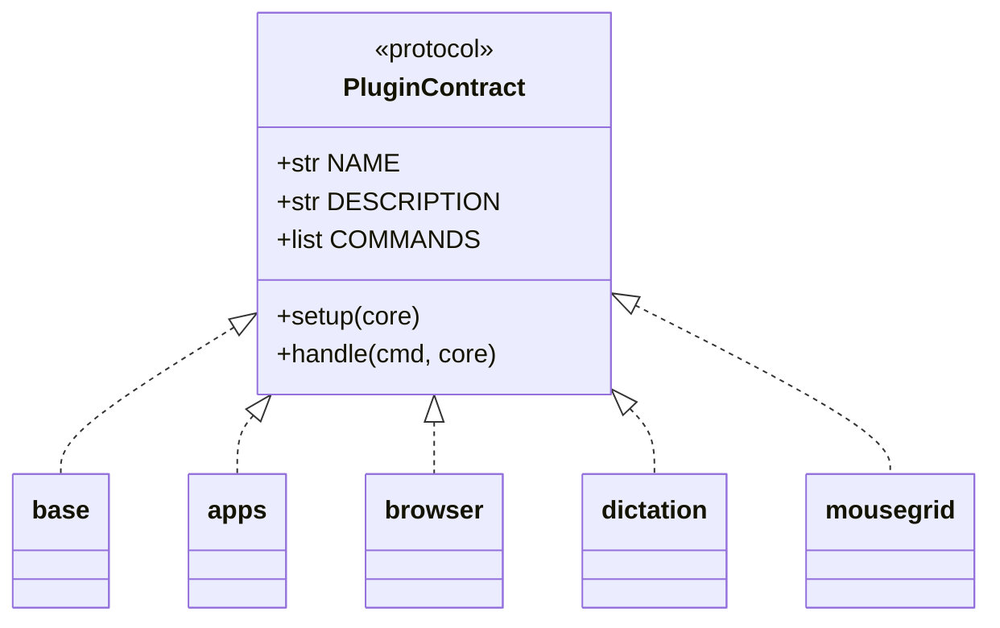

# Writing plugins

Drop a Python file in `plugins/` and it gets loaded automatically.

```python
NAME = "myplugin"
DESCRIPTION = "What it does"

COMMANDS = [
    "say hello - speaks a greeting",
]


def setup(core):
    """Called once at startup. Store the core reference if needed."""


def handle(cmd, core):
    """Called for every voice command.

    Return True if handled, None to pass to the next plugin.
    """
    if "say hello" in cmd:
        core.speak("Hello there!")
        return True
    return None
```

## The plugin contract

A module is loaded as a plugin if it exposes a `NAME` and a `handle` function.
There is no base class to subclass — plugins follow a duck-typed protocol:



- `NAME` — short identifier shown in the help screen (required)
- `DESCRIPTION` — one-line summary for the help screen
- `COMMANDS` — list of `"phrase - description"` strings for the help screen
- `setup(core)` — optional one-time hook; store the `core` reference and do any
  host-environment setup here
- `handle(cmd, core)` — required; returns `True` if it consumed the command,
  `False` to make the daemon exit, or `None` to pass the command on

## Core methods you can use

| Method | Purpose |
|--------|---------|
| `core.speak("text")` | Text-to-speech response |
| `core.host_run(["cmd", "arg"])` | Run a shell command |
| `core.transcribe(audio)` | Transcribe audio to text |
| `core.wait_for_speech()` | Wait for the user to start speaking |
| `core.record_until_silence()` | Record until the user stops |
| `core.deactivate()` | Put the assistant to sleep |

The full surface is documented on the [`EasySpeak`][core.main.EasySpeak]
class.

## Loading order

Plugins load alphabetically. Use number prefixes to control order
(`00_mousegrid.py` loads before `apps.py`), and the `zz_` prefix loads the base
plugin last so it acts as the catch-all for help and exit. Files whose names
start with `_` are skipped.

See the [Plugins API reference](reference/plugins.md) for the generated
documentation of every bundled plugin.
