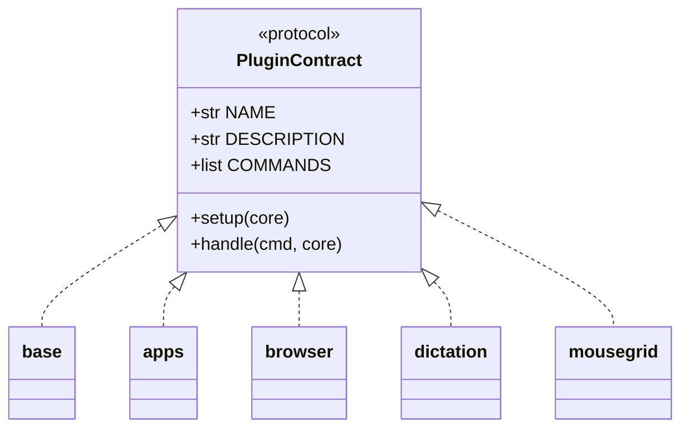

# Writing plugins

Drop a Python file in `plugins/` and it gets loaded automatically. A plugin that
speaks in the user's language is a package instead: a directory with an
`__init__.py` holding the same code, plus a `locale/` directory of translations
(see [Translations](#translations)).

```python
NAME = "myplugin"
DESCRIPTION = "What it does"

COMMANDS = [
    "say hello - speaks a greeting",
]


def setup(core):
    """Called once at startup. Store the core reference if needed."""


def handle(cmd, core):
    """Called for every voice command.

    Return True if handled, None to pass to the next plugin.
    """
    if "say hello" in cmd:
        core.speak("Hello there!")
        return True
    return None
```

## The plugin contract

A module is loaded as a plugin if it exposes a `NAME` and a `handle` function.
There is no base class to subclass — plugins follow a duck-typed protocol:


```mermaid
classDiagram
    class PluginContract {
        <<protocol>>
        +str NAME
        +str DESCRIPTION
        +list COMMANDS
        +setup(core)
        +handle(cmd, core)
    }
    PluginContract <|.. base
    PluginContract <|.. apps
    PluginContract <|.. browser
    PluginContract <|.. dictation
    PluginContract <|.. mousegrid
```

- `NAME` — short identifier shown in the help screen (required)
- `DESCRIPTION` — one-line summary for the help screen
- `COMMANDS` — list of `"phrase - description"` strings for the help screen
- `setup(core)` — optional one-time hook; store the `core` reference and do any
  host-environment setup here
- `handle(cmd, core)` — required; returns `True` if it consumed the command,
  `False` to make the daemon exit, or `None` to pass the command on

## Core methods you can use

| Method | Purpose |
|--------|---------|
| `core.speak("text")` | Text-to-speech response |
| `core.host_run(["cmd", "arg"])` | Run a shell command |
| `core.transcribe(audio)` | Transcribe audio to text |
| `core.wait_for_speech()` | Wait for the user to start speaking |
| `core.record_until_silence()` | Record until the user stops |
| `core.deactivate()` | Put the assistant to sleep |

The full surface is documented on the [`EasySpeak`][core.main.EasySpeak]
class.

## Routing order

A command is offered to the plugins in order of their `PRIORITY` (default 50,
lower first, equal ones by name). The grid and head-tracking modes declare `0`
and `1`, so their words reach them before a look-alike elsewhere, and the base
plugin declares `100` to act as the catch-all for help and exit. Files and
directories whose names start with `_` are skipped.

## Translations

Replies are written in English and spoken in the user's language where a
translation exists. A plugin opts in with one line and wraps what it speaks:

```python
from easyspeak.core.i18n import translator

_ = translator(__file__)


def handle(cmd, core):
    if "say hello" in cmd:
        core.speak(_("Hello there!"))
        return True
    return None
```

Text with a value in it stays a template until it is looked up:
`core.speak(_("Opening {app}.").format(app=app))`.

The translations are gettext catalogs beside the code, one per language:
`myplugin/locale/de/LC_MESSAGES/myplugin.po`, the domain being the package's
name. `just translations de` extracts the wrapped strings and creates or
refreshes every `.po` for German; then fill in the `msgstr` lines, in Poedit or
any editor. A string without a translation is spoken in English. See
[`core.i18n`][core.i18n].

See the [Plugins API reference](reference/plugins.md) for the generated
documentation of every bundled plugin.
