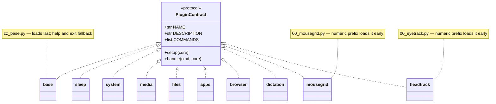

# Plugins API

Every plugin is a plain Python module that follows a small contract rather than
subclassing a base class. A module is loaded if it exposes a `NAME` string and a
`handle(cmd, core)` function; the optional `setup(core)` hook runs once at
startup, and `COMMANDS`/`DESCRIPTION` feed the help screen.

`handle` returns `True` when it consumed the command, `False` to signal the
daemon to exit, or `None` to pass the command to the next plugin. Load order is
alphabetical, so numeric prefixes (`00_`) load a plugin early and the `zz_`
prefix loads the base plugin last as the catch-all for help and exit.

## base (zz_base)

::: plugins.zz_base

## sleep

::: plugins.sleep

## system

::: plugins.system

## media

::: plugins.media

## files

::: plugins.files

## apps

::: plugins.apps

## browser

::: plugins.browser

## dictation

::: plugins.dictation

## mousegrid (00_mousegrid)

::: plugins.00_mousegrid

## headtrack (00_eyetrack)

::: plugins.00_eyetrack
