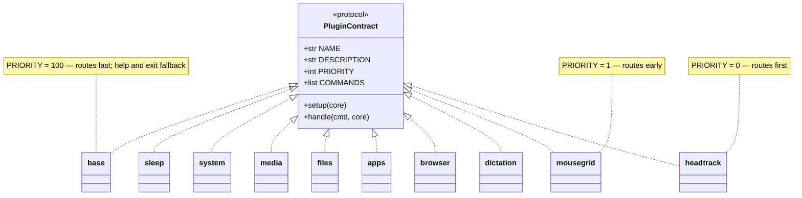

# Plugins API

Every plugin is a Python package (or a plain module) that follows a small
contract rather than subclassing a base class. It is loaded if it exposes a
`NAME` string and a `handle(cmd, core)` function; the optional `setup(core)` hook
runs once at startup, `COMMANDS`/`DESCRIPTION` feed the help screen, and
`PRIORITY` (default 50, lower first) sets its place in the routing order. A
package's `locale/` holds the translations of what it speaks.

```mermaid
classDiagram
    class PluginContract {
        <<protocol>>
        +str NAME
        +str DESCRIPTION
        +int PRIORITY
        +list COMMANDS
        +setup(core)
        +handle(cmd, core)
    }
    class base
    class sleep
    class system
    class media
    class files
    class apps
    class browser
    class dictation
    class mousegrid
    class headtrack

    PluginContract <|.. base
    PluginContract <|.. sleep
    PluginContract <|.. system
    PluginContract <|.. media
    PluginContract <|.. files
    PluginContract <|.. apps
    PluginContract <|.. browser
    PluginContract <|.. dictation
    PluginContract <|.. mousegrid
    PluginContract <|.. headtrack

    note for base "PRIORITY = 100 — routes last; help and exit fallback"
    note for mousegrid "PRIORITY = 1 — routes early"
    note for headtrack "PRIORITY = 0 — routes first"
```

`handle` returns `True` when it consumed the command, `False` to signal the
daemon to exit, or `None` to pass the command to the next plugin, in order of
`PRIORITY`: the modes first, the base plugin last as the catch-all for help and
exit.

## base

::: plugins.base

## sleep

::: plugins.sleep

## system

::: plugins.system

## media

::: plugins.media

## files

::: plugins.files

## apps

::: plugins.apps

## browser

::: plugins.browser

## dictation

::: plugins.dictation

## mousegrid

::: plugins.mousegrid

## headtrack

::: plugins.headtrack
